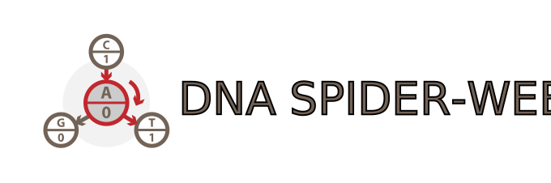

<p align="center">

</p>

[](https://circleci.com/gh/HaolingZHANG/DNASpiderWeb/tree/main)
[](https://coveralls.io/github/HaolingZhang/DNASpiderWeb?branch=master)
[](https://img.shields.io/badge/python-3.7%20%7C%203.8%20%7C%203.9-blue)
[](https://github.com/HaolingZHANG/DNASpiderWeb/blob/main/LICENSE)


As a genetic material, DNA has become an attractive medium for storing digital information gradually.
In recent years, a growing number of functional biochemical operations and storage environments were introduced, 
biochemical constraints are not confined to long single-nucleotide repeats and abnormal GC content.
However, trade-offs between information density and compatibility to biochemical operations and algorithms require in-depth investigation, 
to create transcoding algorithms considering novel biochemical constraints and their combinations.
Here, we design an automatic generator, named SPIDER-WEB, 
to create corresponding graph-based algorithms 
which could be used directly or served as a benchmark for artificial algorithm design.
The generated coding algorithms provide 
[high code rate](https://github.com/HaolingZHANG/DNASpiderWeb/blob/main/experiments/step_1_compatibility.py),
[low parameter sensitivity](https://github.com/HaolingZHANG/DNASpiderWeb/blob/main/experiments/step_3_stability.py),
[certain self-repair ability](https://github.com/HaolingZHANG/DNASpiderWeb/blob/main/experiments/step_4_repairability.py), and
[valuable privacy protection potentiality](https://github.com/HaolingZHANG/DNASpiderWeb/blob/main/experiments/step_5_privacy.py).
Through this work, applicable algorithms with appropriate density-compatibility trade-off under arbitrary local biochemical constraints could be generated in an automated way. 
It is also suggested that more kinds of biochemical constraints can be further investigated as more complex operations would be needed in future DNA storage systems.

## Installation
You can install this package using pip:
```sh
pip install dsw
```

The packages requires a python version >=3.7, 
as well as some basic libraries (only [numpy 1.17.1](https://pypi.org/project/numpy/) and [scipy 1.3.1](https://pypi.org/project/scipy/)) listed in [requirements file](https://github.com/HaolingZHANG/DNASpiderWeb/blob/main/requirements.txt).

Furthermore, if you want to try / repeat the completed experiments in this work.
Some additional libraries need to be installed, that is, 
[Chamaeleo 1.34](https://pypi.org/project/Chamaeleo/), [matplotlib 3.1.1](https://pypi.org/project/matplotlib/), 
and [biopython 1.78](https://pypi.org/project/biopython/).
These experimental Python scripts [here](https://github.com/HaolingZHANG/DNASpiderWeb/tree/main/experiments) are single threaded. 
It may take about several months to complete all experiments on a conventional laptop (reference: Intel i7-4710MQ @ 2.50GHz).
In order to further understand the experimental situation, 
like getting [raw data](https://github.com/HaolingZHANG/DNASpiderWeb/tree/main/experiments/results/data/NOTES.md), 
please do not hesitate to contact us.

## Library structure
The structure of this library is shown below:
```html
├── dsw                                     // Source codes of DNA SPIDER-WEB
│    ├── __init__.py                        // Exhibition of class and method calls
│    ├── biofilter.py                       // Biochemical constraint filter to judge whether the candidate DNA string is valid or invalid
│    │    ├── DefaultBioFilter              // Default biochemical constraint filter inherited by all related filters
│    │    ├── LocalBioFilter                // Local biochemical constraint filter in our work
│    ├── graphized.py                       // Special data structures and functions related to graph theory
│    │    ├── get_complete_accessor         // Get a complete accessor with the required observed length
│    │    ├── adjacency_matrix_to_accessor  // Convert the adjacency matrix to the equivalent accessor (compressed matrix)
│    │    ├── accessor_to_adjacency_matrix  // Convert the accessor to its equivalent adjacency matrix
│    │    ├── latter_map_to_accessor        // Convert the latter map (linked storage structure of graph) to its equivalent accessor
│    │    ├── accessor_to_latter_map        // Convert the accessor to its equivalent latter map
│    │    ├── remove_useless                // Remove useless vertices (the out-degree of witch less than threshold) in the latter map
│    │    ├── obtain_formers                // Obtain in-degree vertex indices based on the current vertex index
│    │    ├── obtain_latters                // Obtain out-degree vertex indices based on the current vertex index
│    │    ├── obtain_leaf_vertices          // Obtain leaf vertex indices based on the current vertex index and the depth
│    │    ├── approximate_capacity          // Approximate the capacity of the specific graph through Perron–Frobenius theorem
│    │    ├── path_matching                 // Perform saturation repair by matching the path of the accessor
│    ├── operation.py                       // Progress monitor and digital calculation operation
│    │    ├── Monitor                       // Monitor which outputting the progress based on current state and total state
│    │    ├── calculus_addition             // Do huge number addition calculus with a small base value, as number + base
│    │    ├── calculus_subtraction          // Do huge number subtraction calculus with a small base value, as number - base
│    │    ├── calculus_multiplication       // Do huge number multiplication calculus with a small base value, as number * base
│    │    ├── calculus_division             // Do huge number division calculus with a small base value, as number / base and number % base
│    │    ├── bit_to_number                 // Convert a bit array to its equivalent decimal number
│    │    ├── number_to_bit                 // Convert a decimal number to its equivalent bit array with specific length
│    │    ├── dna_to_number                 // Convert a DNA string to its equivalent decimal number
│    │    ├── number_to_dna                 // Convert a decimal number to its equivalent DNA string with specific length
│    ├── spiderweb.py                       // Generating, transcoding, repairing pipelines of DNA SPIDER-WEB
│    │    ├── encode                        // Encode a bit array by the specific accessor
│    │    ├── decode                        // Decode a DNA string by the specific accessor
│    │    ├── repair_dna                    // Repair the DNA string containing one (or more) errors
│    │    ├── find_vertices                 // Find valid vertices based on the given the biochemical constraints
│    │    ├── connect_valid_graph           // Connect a valid graph by valid vertices
│    │    ├── connect_coding_graph          // Connect a coding algorithm by valid vertices and the threshold for minimum out-degree
│    │    ├── create_random_shuffles        // Create the shuffles for accessor through the random mechanism
├── experiments                             // Experiment module of DNA SPIDER-WEB
│    ├── __init__.py                        // Local biochemical constraint set in this work
│    ├── step_1_compatibility.py            // Experiments for the gap between code rates obtained from generated algorithms and the corresponding capacities
│    ├── step_2_reliability.py              // Experiments for the relative errors of capacity approximation
│    ├── step_3_stability.py                // Experiments for the code rates obtained from SPIDER-WEB and other advanced algorithms
│    ├── step_4_repairability.py            // Experiments for the average DNA string length in case the heap preset size
│    ├── step_5_privacy.py                  // Experiments for the hidden danger of graph (algorithm) reconstruction and two additional privacy algorithms
│    ├── step_6_overviews.py                // Presentation of non-academic integrated results
├── test                                    // Test module of source codes
│    ├── test_accessor_vs_latter_map.py     // Unit test for the conversion between the accessor and the latter map
│    ├── test_accessor_vs_matrix.py         // Unit test for the conversion between the accessor and the adjacency matrix
│    ├── test_bio_filters.py                // Unit test for the correctness of the biochemical constraint filter
│    ├── test_capacities.py                 // Unit test for the reliability if the capacity approximation 
│    ├── test_number_vs_binary_message.py   // Unit test for the conversion between the decimal number and binary message
│    ├── test_number_vs_dna_string.py       // Unit test for the conversion between the decimal number and DNA string
│    ├── test_operations.py                 // Unit test for the correctness of large number basic operations
│    ├── test_shuffles.py                   // Unit test for the transcoding correctness when using the shuffle strategy
├── README.md                               // Description document of library
```
The installation process only includes folder 'dsw' and its internal files.

## Basic evaluation
Some investigations of 
[SPIDER-WEB](https://github.com/HaolingZHANG/DNASpiderWeb/blob/main/dsw/spiderweb.py) are recorded 
[here](https://github.com/HaolingZHANG/DNASpiderWeb/tree/main/experiments/results/figures/REPORTS.md), 
which are generated directly through the [process Python scripts](https://github.com/HaolingZHANG/DNASpiderWeb/tree/main/experiments/).
Compared with 
[HEDGES](https://www.pnas.org/content/117/31/18489.full), 
[DNA Fountain](https://www.science.org/doi/abs/10.1126/science.aaj2038) and 
[Yin-Yang Code](https://www.biorxiv.org/content/10.1101/829721v3), 
the rough (**not academic**) conclusions are as follows:

<p align="center">

</p>

where 
* [C-R] refers to the code rate, the statistical result of which is the average number of binary bits encoded per nucleotide; 
* [C-A] refers to the codability, the statistical result of which is the success rate of encoding process;
* [P-S] refers to the parameter sensibility, the statistical result of which is the reciprocal of normalized standard deviation of code rate;
* [R-A] refers to the repairability, the statistical result of which is the normalized average DNA length of lossless decoding.

For detailed design, evaluations and conclusions, please refer to our publication.

## Customization
### biochemical constraints set
You can create your customized biochemical constraint filter (as the biochemical constraints set) 
by inheriting [DefaultBioFilter](https://github.com/HaolingZHANG/DNASpiderWeb/blob/main/dsw/biofilter.py#L4).
For example:

```python
from dsw import DefaultBioFilter

class RegionalizedGCFilter(DefaultBioFilter):

    def __init__(self, window_length, gc_bias):
        super().__init__(screen_name="Regionalized GC content constraint")
        self._window_length = window_length
        self._gc_bias = gc_bias  # bias based on 0.5 (or 50%)
    
    def valid(self, dna_string):
        if len(dna_string) >= self._window_length:
            for index in range(len(dna_string) - self._window_length + 1):  # judge in a window
                regional_dna_string = dna_string[index: index + self._window_length]
                gc_count = regional_dna_string.count("C") + regional_dna_string.count("G")
                if gc_count > (0.5 + self._gc_bias) * self._window_length:
                    return False
                if gc_count < (0.5 - self._gc_bias) * self._window_length:
                    return False
                    
        else:
            gc_count = dna_string.count("C") + dna_string.count("G")
            if gc_count > (0.5 + self._gc_bias) * self._window_length:
                return False
            at_count = dna_string.count("A") + dna_string.count("T")
            if at_count > (0.5 + self._gc_bias) * self._window_length:
                return False
                
        return True
```

Here is an investigated example in this work named [LocalBioFilter](https://github.com/HaolingZHANG/DNASpiderWeb/blob/main/dsw/biofilter.py#L30).

### capacity approximation
Through our customized approximater, 
see [here](https://github.com/HaolingZHANG/DNASpiderWeb/blob/main/dsw/graphized.py#L537), 
you can easily obtain the capacity under the specific biochemical constraint set.
```python
from dsw import LocalBioFilter, find_vertices, connect_valid_graph, approximate_capacity

bio_filter = LocalBioFilter(max_homopolymer_runs=2, gc_range=[0.4, 0.6], undesired_motifs=["GCC"])
vertices = find_vertices(observed_length=10, bio_filter=bio_filter)
accessor = connect_valid_graph(observed_length=10, vertices=vertices)  # representation of directed graph
capacity = approximate_capacity(accessor=accessor)
print(capacity)
```

The capacity approximater is based on the Perron–Frobenius theorem,
we have proved its applicability for variable-length coding algorithms in the publication.

Unfortunately, when the observed length (or window length) reaches 8, 
the data capacity will achieve 32.0GB with the data type (double-precision floating-point format), 
which is unable to be allocated (both MATLAB and Python platforms).
Therefore, see [here](https://github.com/HaolingZHANG/DNASpiderWeb/blob/main/dsw/graphized.py),
we provide a series of special data structures and approximation algorithms 
to complete the representation of graphs and the solution of largest eigenvalues.
 
To verify its [reliability](https://github.com/HaolingZHANG/DNASpiderWeb/blob/main/experiments/step_2_reliability.py), 
we compared our proposed method with Numpy ``linalg.eig'' function in some small-scale matrices.
As part of the experimental results, the median value of relative error analysis is 2.97E-11, 
which represents our proposed method is high reliability and negligible error. 

<p align="center">

</p>

### coding algorithm generation
According to SPIDER-WEB, you can obtain the corresponding variable-length algorithms:

```python
from dsw import LocalBioFilter, find_vertices, connect_coding_graph

bio_filter = LocalBioFilter(max_homopolymer_runs=2, gc_range=[0.4, 0.6], undesired_motifs=["ACA", "CAC", "GTG", "TGT"])
vertices = find_vertices(observed_length=10, bio_filter=bio_filter)
accessor = connect_coding_graph(observed_length=10, vertices=vertices, threshold=1)  # representation of directed graph
```
In [experiments folder](https://github.com/HaolingZHANG/DNASpiderWeb/blob/main/experiments/__init__.py), 
you can easily find 12 examples in our experiments under the observed length 10, the local biochemical constraint set are:

| set index | homopolymer run-length constraint | regionalized GC content constraint | undesired motif constraint | approximated capacity |
| ---- | ---- | ---- | ---- | ----|
| 1 |  2  | 50%~50% | restriction sites | 1.0000 |
| 2 |  1  |   N/A   | N/A | 1.5850 |
| 3 | N/A | 10%~30% | N/A | 1.6302 |
| 4 |  2  | 40%~60% | similar structures | 1.6698 |
| 5 |  2  | 40%~60% | N/A | 1.7761 |
| 6 | N/A | 50%~70% | N/A | 1.7958 |
| 7 |  3  | 40%~60% | N/A | 1.8114 |
| 8 |  4  | 40%~60% | N/A | 1.8152 |
| 9 |  3  |   N/A   | N/A | 1.9824 |
| 10 |  4  |   N/A   | N/A | 1.9957 |
| 11 |  5  |   N/A   | N/A | 1.9989 |
| 12 |  6  |   N/A   | N/A | 1.9997 |

Here the restriction sites represent AGCT, GACGC, CAGCAG, GATATC, GGTACC, CTGCAG, GAGCTC, GTCGAC, AGTACT, ACTAGT, GCATGC, AGGCCT, and TCTAGA.
Meanwhile, the similar structures in Nanopore sequencing are AGA, GAG, CTC, and TCT.

The corresponding transcoding performances of generated coding algorithms are shown as below:

<p align="center">

</p>

where the blue line is the approximated capacity and 
red violin plot (with median point) is tens of thousands of groups of (bit/nucleotide) results.


## Citation
If you think this repo helps or being used in your research, please consider refer this paper.
Here is a Bibtex entry:

````
@article{zhang2021spider,
  title={SPIDER-WEB is all your need for creating coding algorithms in DNA-based storage},
  author={Zhang, Haoling and Lan, Zhaojun and Ping, Zhi and Zhang, Yiwei and Shen, Yue},
  journal={XXX},
  year={XXX},
  pages={XXX},
}
````