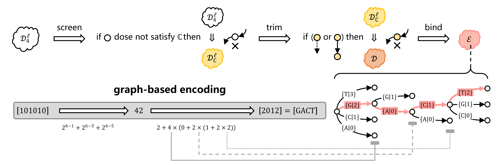
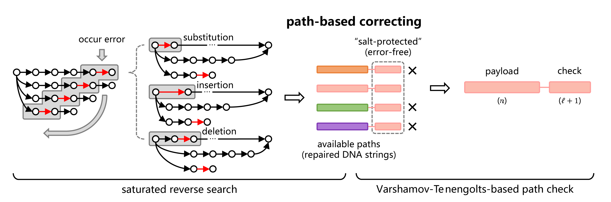
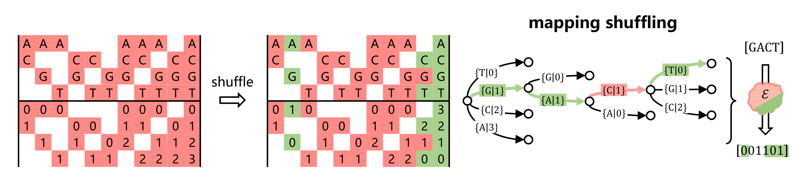

<p align="center">

</p>

[](https://circleci.com/gh/HaolingZHANG/DNASpiderWeb/tree/main)
[](https://img.shields.io/badge/python-3.7-blue)
[](https://github.com/HaolingZHANG/DNASpiderWeb/blob/main/LICENSE)


DNA has become an attractive medium for storing digital information gradually. 
Despite the biochemical progress on DNA synthesis and sequencing, 
novel coding algorithms need to be constructed under the specific constraints in DNA-based storage. 
In recent years, a growing number of functional operations and storage carriers were introduced, 
bringing in various biochemical constraints including but not confined to long single-nucleotide repeats and abnormal GC content. 
Given several local biochemical constraints and their combinations, 
existing coding algorithms are not applicable or unstable. 
In this paper, we design a graph-based architecture, named **SPIDER-WEB**, 
to generate corresponding graph-based algorithms under arbitrary local biochemical constraints.
These generated coding algorithms could be used to encode arbitrary digital data as DNA sequences directly 
or served as a benchmark for the follow-up construction of coding algorithms. 
To further consider recovery and security issues existing in the storage field, 
it also provides pluggable algorithmic patches based on the generated coding algorithms: 
path-based correcting and mapping shuffling.
They provide approaches for probabilistic error correction and symmetric encryption respectively.

## Installation
You can install this package using pip:
```sh
pip install DNASpiderWeb
```

The packages requires a python version >=3.7, 
as well as some basic libraries 
(only [numpy 1.17.1](https://pypi.org/project/numpy/) and [scipy 1.3.1](https://pypi.org/project/scipy/)) 
listed in [requirements file](https://github.com/HaolingZHANG/DNASpiderWeb/blob/main/requirements.txt).

Furthermore, if you want to try / repeat the completed experiments in this work.
Some additional libraries need to be installed, that is, 
[Chamaeleo 1.34](https://pypi.org/project/Chamaeleo/), [matplotlib 3.1.1](https://pypi.org/project/matplotlib/), 
and [biopython 1.78](https://pypi.org/project/biopython/).
These experimental Python scripts [here](https://github.com/HaolingZHANG/DNASpiderWeb/tree/main/experiments) are single threaded. 
It may take about several months to complete all experiments on a conventional laptop (reference: Intel i7-4710MQ @ 2.50GHz).
In order to further understand the experimental situation, the core raw data are saved
[here](https://github.com/HaolingZHANG/DNASpiderWeb/blob/main/experiments/results/raw%20data.xlsx).
If you want the whole raw data, please do not hesitate to contact us.

If you are interested in detailed design, evaluations, conclusions, mathematical proofs, and implementations, 
please refer to our [publication](https://arxiv.org/pdf/2204.02855.pdf).

## Usage and Customization
### biochemical constraints set
You can create your customized biochemical constraint filter (as the biochemical constraints set) 
by inheriting [DefaultBioFilter](https://github.com/HaolingZHANG/DNASpiderWeb/blob/main/dsw/biofilter.py#L4).
For example:

```python
from dsw import DefaultBioFilter

class RegionalizedGCFilter(DefaultBioFilter):

    def __init__(self, window_length, gc_bias):
        super().__init__(screen_name="Regionalized GC content constraint")
        self._window_length = window_length
        self._gc_bias = gc_bias  # bias based on 0.5 (or 50%)
    
    def valid(self, dna_string):
        if len(dna_string) >= self._window_length:
            for index in range(len(dna_string) - self._window_length + 1):  # judge in a window
                regional_dna_string = dna_string[index: index + self._window_length]
                gc_count = regional_dna_string.count("C") + regional_dna_string.count("G")
                if gc_count > (0.5 + self._gc_bias) * self._window_length:
                    return False
                if gc_count < (0.5 - self._gc_bias) * self._window_length:
                    return False
                    
        else:
            gc_count = dna_string.count("C") + dna_string.count("G")
            if gc_count > (0.5 + self._gc_bias) * self._window_length:
                return False
            at_count = dna_string.count("A") + dna_string.count("T")
            if at_count > (0.5 + self._gc_bias) * self._window_length:
                return False
                
        return True
```

Here is an investigated example in this work named 
[LocalBioFilter](https://github.com/HaolingZHANG/DNASpiderWeb/blob/main/dsw/biofilter.py#L30).

### capacity approximation
Through our customized approximater, 
see [here](https://github.com/HaolingZHANG/DNASpiderWeb/blob/main/dsw/graphized.py#L534), 
you can easily obtain the capacity under the specific biochemical constraint set.
```python
from dsw import LocalBioFilter, find_vertices, connect_valid_graph, approximate_capacity

bio_filter = LocalBioFilter(max_homopolymer_runs=2, gc_range=[0.4, 0.6], undesired_motifs=["GCC"])
vertices = find_vertices(observed_length=10, bio_filter=bio_filter)
accessor = connect_valid_graph(observed_length=10, vertices=vertices)  # representation of directed graph
capacity = approximate_capacity(accessor=accessor)
print(capacity)
```

The capacity approximater is based on the Perron–Frobenius theorem,
we have proved its applicability for coding algorithms 
in the Appendix A of our [publication](https://arxiv.org/pdf/2204.02855.pdf).

Unfortunately, when the observed length (or window length) reaches 8, 
the data capacity will achieve 16.0GB with the data type (integer format), 
which is unable to be allocated (both MATLAB and Python platforms).
Therefore, see [here](https://github.com/HaolingZHANG/DNASpiderWeb/blob/main/dsw/graphized.py),
we provide a series of special data structures and approximation algorithms 
to complete the representation of graphs and the solution of largest eigenvalues.
 
To verify its [reliability](https://github.com/HaolingZHANG/DNASpiderWeb/blob/main/experiments/step_2_reliability.py), 
we compared our proposed method with Numpy ``linalg.eig'' function in some small-scale matrices.
As part of the experimental results, the median value of relative error analysis is 2.97E-11, 
which represents the relative error of capacity approximation is on the order of minus ten of ten.
Because it is equivalent to error tolerance in the preset values, 
we believe our proposed method is high reliability and negligible error. 

### graph-based encoding
<p align="center">

</p>

According to **SPIDER-WEB**, you can generate a coding algorithm under the established biochemical constraints.
For example,
```python
from dsw import LocalBioFilter, find_vertices, connect_coding_graph
bio_filter = LocalBioFilter(max_homopolymer_runs=2, gc_range=[0.4, 0.6], undesired_motifs=["ACA", "CAC", "GTG", "TGT"])
vertices = find_vertices(observed_length=10, bio_filter=bio_filter)
accessor = connect_coding_graph(observed_length=10, vertices=vertices, threshold=1)  # representation of directed graph
```
In [experiments folder](https://github.com/HaolingZHANG/DNASpiderWeb/blob/main/experiments/__init__.py), 
you can easily find 12 examples in our experiments under the observed length 10, the local biochemical constraint set are:

| set index | homopolymer run-length | regionalized GC content | undesired motifs | approximated capacity |
| ---- | ---- | ---- | ---- | ----|
| 01 |  2  | 50%~50% | restriction sites | 1.0000 |
| 02 |  1  |   N/A   | N/A | 1.5850 |
| 03 | N/A | 10%~30% | N/A | 1.6302 |
| 04 |  2  | 40%~60% | similar structures | 1.6698 |
| 05 |  2  | 40%~60% | N/A | 1.7761 |
| 06 | N/A | 50%~70% | N/A | 1.7958 |
| 07 |  3  | 40%~60% | N/A | 1.8114 |
| 08 |  4  | 40%~60% | N/A | 1.8152 |
| 09 |  3  |   N/A   | N/A | 1.9824 |
| 10 |  4  |   N/A   | N/A | 1.9957 |
| 11 |  5  |   N/A   | N/A | 1.9989 |
| 12 |  6  |   N/A   | N/A | 1.9997 |

Here the restriction sites represent AGCT, GACGC, CAGCAG, GATATC, GGTACC, CTGCAG, GAGCTC, GTCGAC, AGTACT, ACTAGT, GCATGC, AGGCCT, and TCTAGA.
Meanwhile, the similar structures in Nanopore sequencing are AGA, GAG, CTC, and TCT.

The corresponding coding performances of generated coding algorithms are shown 
in the evaluation section of our [publication](https://arxiv.org/pdf/2204.02855.pdf).

As an example, the encoding process for a GC-balanced accessor is:
```python
from numpy import array
from dsw import encode
accessor = array([[-1, -1, -1, -1], [ 4, -1, -1,  7], [ 8, -1, -1, 11], [-1, -1, -1, -1], 
                  [-1,  1,  2, -1], [-1, -1, -1, -1], [-1, -1, -1, -1], [-1, 13, 14, -1], 
                  [-1,  1,  2, -1], [-1, -1, -1, -1], [-1, -1, -1, -1], [-1, 13, 14, -1], 
                  [-1, -1, -1, -1], [ 4, -1, -1,  7], [ 8, -1, -1, 11], [-1, -1, -1, -1]])
binary_message = array([0, 1, 0, 1, 0, 1, 0, 1])
encode(accessor=accessor, binary_message=binary_message, start_index=1)
```
and a DNA string 
````
'TCTCTCT'
```` 
will be obtained.

Reversely, in the decoding process:
```python
from numpy import array
from dsw import decode
accessor = array([[-1, -1, -1, -1], [ 4, -1, -1,  7], [ 8, -1, -1, 11], [-1, -1, -1, -1], 
                  [-1,  1,  2, -1], [-1, -1, -1, -1], [-1, -1, -1, -1], [-1, 13, 14, -1], 
                  [-1,  1,  2, -1], [-1, -1, -1, -1], [-1, -1, -1, -1], [-1, 13, 14, -1], 
                  [-1, -1, -1, -1], [ 4, -1, -1,  7], [ 8, -1, -1, 11], [-1, -1, -1, -1]])
dna_string = "TCTCTCT"
decode(accessor=accessor, dna_string=dna_string, start_index=1, bit_length=8)
```
and you will obtain a binary message with NumPy format: 
````
array([0, 1, 0, 1, 0, 1, 0, 1])
````      
        
### path-based correcting
<p align="center">

</p>

Before biochemical operation, 
it may be considered to provide better error correction performance using an additional 'salt-protected' DNA string.
Here, we provide the such short DNA string an the value check based on Varshamov-Tenengolts code.
You can use the code as follow:
```python
from dsw import set_vt
vt_length = 5
dna_string = "TCTCTCT"
set_vt(dna_string=dna_string, vt_length=vt_length)
```
After that, you'll get a check string:
````
'TAATA'
```` 

Without the check string, you can repair the DNA string directly through our proposed 'saturated reverse search'.
Here is a case:
```python
from numpy import array
from dsw import repair_dna
accessor = array([[-1, -1, -1, -1], [ 4, -1, -1,  7], [ 8, -1, -1, 11], [-1, -1, -1, -1], 
                  [-1,  1,  2, -1], [-1, -1, -1, -1], [-1, -1, -1, -1], [-1, 13, 14, -1], 
                  [-1,  1,  2, -1], [-1, -1, -1, -1], [-1, -1, -1, -1], [-1, 13, 14, -1], 
                  [-1, -1, -1, -1], [ 4, -1, -1,  7], [ 8, -1, -1, 11], [-1, -1, -1, -1]])
dna_string = "TCTCTATCTCTC"  # "TCTCTCTCTCTC" is original DNA string
repair_dna(dna_string=dna_string, accessor=accessor, start_index=1, observed_length=2, 
           check_iterations=1, has_insertion=True, has_deletion=True, verbose=False)
```
The returned data is a tuple: 
````
(['TCTCTCTCTCTC', 'TCTCTGTCTCTC'], (True, False, 2))
````
The former one is the repair string set, which may contain one or more candidate solutions.
The latter one is the temporary parameters in the repair process are used to evaluate the repair results.

After using check string, the result of path-based correcting improved significantly:
```python
from numpy import array
from dsw import repair_dna
accessor = array([[-1, -1, -1, -1], [ 4, -1, -1,  7], [ 8, -1, -1, 11], [-1, -1, -1, -1], 
                  [-1,  1,  2, -1], [-1, -1, -1, -1], [-1, -1, -1, -1], [-1, 13, 14, -1], 
                  [-1,  1,  2, -1], [-1, -1, -1, -1], [-1, -1, -1, -1], [-1, 13, 14, -1], 
                  [-1, -1, -1, -1], [ 4, -1, -1,  7], [ 8, -1, -1, 11], [-1, -1, -1, -1]])
dna_string = "TCTCTATCTCTC"  # "TCTCTCTCTCTC" is original DNA string
vt_check = "AACTG"  # check list of Varshamov-Tenengolts code.
repair_dna(dna_string=dna_string, accessor=accessor, start_index=1, observed_length=2, 
           check_iterations=1, vt_check=vt_check, has_insertion=True, has_deletion=True, verbose=False)
```
The updated result is: 
````
(['TCTCTCTCTCTC'], (True, True, 2))
````

### mapping shuffling
<p align="center">

</p>

To provide a certain amount of additional security against eavesdroppers, 
it would be nice to create a shuffled matrix to disorganize
the label order of different vertices in the digraph for the encoding process.
You can design a matrix with shape of 4^l times 4 (l refers to the observed length).
Each row of this matrix is the order of 0 ~ 3.
As an alternative, you can create a random matrix (supporting random seed setup), see below:
```python
from dsw import create_random_shuffles
create_random_shuffles(observed_length=2, random_seed=2021)
```
By doing so,
````
array([[3, 2, 1, 0], [2, 3, 1, 0], [3, 1, 0, 2], [0, 3, 1, 2],
       [3, 2, 0, 1], [1, 0, 3, 2], [0, 3, 1, 2], [2, 0, 1, 3],
       [2, 3, 0, 1], [1, 0, 3, 2], [2, 0, 1, 3], [0, 1, 3, 2],
       [2, 3, 1, 0], [2, 0, 3, 1], [0, 1, 3, 2], [0, 3, 2, 1]])
````
is the returned shuffled matrix.

Using your shuffled matrix, the obtained DNA string will be different than before: 
```python
from numpy import array
from dsw import encode
accessor = array([[-1, -1, -1, -1], [ 4, -1, -1,  7], [ 8, -1, -1, 11], [-1, -1, -1, -1], 
                  [-1,  1,  2, -1], [-1, -1, -1, -1], [-1, -1, -1, -1], [-1, 13, 14, -1], 
                  [-1,  1,  2, -1], [-1, -1, -1, -1], [-1, -1, -1, -1], [-1, 13, 14, -1], 
                  [-1, -1, -1, -1], [ 4, -1, -1,  7], [ 8, -1, -1, 11], [-1, -1, -1, -1]])
binary_message = array([0, 1, 0, 1, 0, 1, 0, 1])
shuffles = array([[3, 2, 1, 0], [2, 3, 1, 0], [3, 1, 0, 2], [0, 3, 1, 2], 
                  [3, 2, 0, 1], [1, 0, 3, 2], [0, 3, 1, 2], [2, 0, 1, 3], 
                  [2, 3, 0, 1], [1, 0, 3, 2], [2, 0, 1, 3], [0, 1, 3, 2], 
                  [2, 3, 1, 0], [2, 0, 3, 1], [0, 1, 3, 2], [0, 3, 2, 1]])
encode(accessor=accessor, binary_message=binary_message, shuffles=shuffles, start_index=1)
```
you can get 
````
'AGAGAGA'
```` 
rather than 'TCTCTCT' before.

If you use mapping shuffling, please don't forget to pass in the corresponding parameter during the decoding process.


## Repository Structure
The structure of this library is shown below:
```html
├── dsw                                     // Source codes of SPIDER-WEB
│    ├── __init__.py                        // Exhibition of class and method calls
│    ├── biofilter.py                       // Biochemical constraint filter to judge whether the candidate DNA string is valid or invalid
│    │    ├── DefaultBioFilter              // Default biochemical constraint filter inherited by all related filters
│    │    ├── LocalBioFilter                // Local biochemical constraint filter in our work
│    ├── graphized.py                       // Special data structures and functions related to graph theory
│    │    ├── get_complete_accessor         // Get a complete accessor with the required observed length
│    │    ├── adjacency_matrix_to_accessor  // Convert the adjacency matrix to the equivalent accessor (compressed matrix)
│    │    ├── accessor_to_adjacency_matrix  // Convert the accessor to its equivalent adjacency matrix
│    │    ├── latter_map_to_accessor        // Convert the latter map (linked storage structure of graph) to its equivalent accessor
│    │    ├── accessor_to_latter_map        // Convert the accessor to its equivalent latter map
│    │    ├── remove_useless                // Remove useless vertices (the out-degree of witch less than threshold) in the latter map
│    │    ├── obtain_formers                // Obtain in-degree vertex indices based on the current vertex index
│    │    ├── obtain_latters                // Obtain out-degree vertex indices based on the current vertex index
│    │    ├── obtain_leaf_vertices          // Obtain leaf vertex indices based on the current vertex index and the depth
│    │    ├── approximate_capacity          // Approximate the capacity of the specific graph through Perron–Frobenius theorem
│    │    ├── path_matching                 // Perform saturation repair by matching the path of the accessor
│    ├── operation.py                       // Progress monitor and digital calculation operation
│    │    ├── Monitor                       // Monitor which outputting the progress based on current state and total state
│    │    ├── calculus_addition             // Do huge number addition calculus with a small base value, as number + base
│    │    ├── calculus_subtraction          // Do huge number subtraction calculus with a small base value, as number - base
│    │    ├── calculus_multiplication       // Do huge number multiplication calculus with a small base value, as number * base
│    │    ├── calculus_division             // Do huge number division calculus with a small base value, as number / base and number % base
│    │    ├── bit_to_number                 // Convert a bit array to its equivalent decimal number
│    │    ├── number_to_bit                 // Convert a decimal number to its equivalent bit array with specific length
│    │    ├── dna_to_number                 // Convert a DNA string to its equivalent decimal number
│    │    ├── number_to_dna                 // Convert a decimal number to its equivalent DNA string with specific length
│    ├── spiderweb.py                       // Generating, transcoding, repairing pipelines of SPIDER-WEB
│    │    ├── encode                        // Encode a bit array by the specific accessor
│    │    ├── decode                        // Decode a DNA string by the specific accessor
│    │    ├── set_vt                        // Set (or calculate) Varshamov-Tenengolts-based path check for DNA string.
│    │    ├── repair_dna                    // Repair the DNA string containing one (or more) errors
│    │    ├── find_vertices                 // Find valid vertices based on the given the biochemical constraints
│    │    ├── connect_valid_graph           // Connect a valid graph by valid vertices
│    │    ├── connect_coding_graph          // Connect a coding algorithm by valid vertices and the threshold for minimum out-degree
│    │    ├── create_random_shuffles        // Create the shuffles for accessor through the random mechanism
├── experiments                             // Experiment module of SPIDER-WEB
│    ├── __init__.py                        // Local biochemical constraint set in this work
│    ├── _1_compatibility.py                // Experiments for the gap between code rates obtained from generated algorithms and the corresponding capacities
│    ├── _2_reliability.py                  // Experiments for the relative errors of capacity approximation
│    ├── _3_stability.py                    // Experiments for the code rates obtained from SPIDER-WEB and other advanced algorithms
│    ├── _4_repairability.py                // Experiments for the probabilistic correction of encoded DNA strings with multiple errors
│    ├── _5_encrypability.py                // Experiments for the hidden danger of graph (algorithm) reconstruction and additional encryption algorithms
│    ├── _6_slide_info.py                   // Drawing scheme for result part in the slides
│    ├── _7_raw_data.py                     // Conversing main raw data to a excel file
│    ├── __init__                           // Preset parameters in the simulation experiment
│    ├── code_encode.py                     // Script in the encoding simulation experiment
│    ├── code_repair.py                     // Script in the correcting simulation experiment
├── tests                                   // Test module of source codes
│    ├── test_accessor_vs_latter_map.py     // Unit test for the conversion between the accessor and the latter map
│    ├── test_accessor_vs_matrix.py         // Unit test for the conversion between the accessor and the adjacency matrix
│    ├── test_bio_filters.py                // Unit test for the correctness of the biochemical constraint filter
│    ├── test_capacities.py                 // Unit test for the reliability if the capacity approximation 
│    ├── test_coding.py                     // Unit test for the default encoding/decoding correctness
│    ├── test_generating.py                 // Unit test for the generating correctness
│    ├── test_number_vs_binary_message.py   // Unit test for the conversion between the decimal number and binary message
│    ├── test_number_vs_dna_string.py       // Unit test for the conversion between the decimal number and DNA string
│    ├── test_operations.py                 // Unit test for the correctness of large number basic operations
│    ├── test_shuffles.py                   // Unit test for the encoding/decoding correctness when using the shuffle strategy
├── README.md                               // Description document of library
```
The installation process only includes folder 'dsw' and  'tests'.


## Citation
If you think this repository helps or being used in your research, please consider refer this work.
Here is a Bibtex entry:

````
@article{zhang2021spider,
  title={SPIDER-WEB enables stable, repairable, and encryptible algorithms under arbitrary local biochemical constraints in DNA-based storage},
  author={Zhang, Haoling and Lan, Zhaojun and Zhang, Wenwei and Xu, Xun and Ping, Zhi and Zhang, Yiwei and Shen, Yue},
  journal={arXiv preprint arXiv:2204.02855},
  year={2022}
}
````
