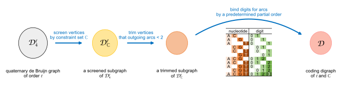
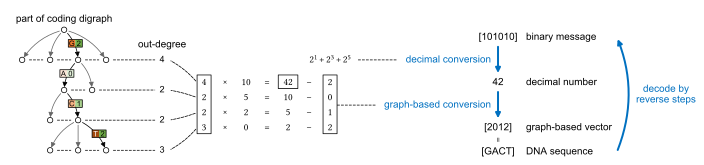
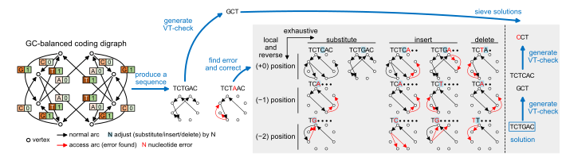
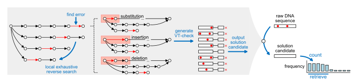

Documentation of SPIDER-WEB
===========================

.. image:: _static/logo.svg

With basic graph theory algorithms,
**SPIDER-WEB** architecture provides contains two basic functions
including bit-to-nucleotide transcoding and error correcting.
Prior to using these two tools,
**SPIDER-WEB** generates the required coding algorithms by the following steps:
set an observed length to generate all the DNA fragments;
then collect valid DNA fragments through the established regional constraints;
after that, connect them into a directed graph using the de Bruijn graph mechanism,
and finally convert this directed graph into a coding algorithm (hereinafter referred to as a coding digraph)
by using a predetermined partial order for binding digits.
Normally, these generated coding digraphs have high information densities which close to their upper bound.

In the established coding digraph, when we access the follow-up vertex from one vertex through the directed edge,
we can obtain the last nucleotide of the follow-up vertex and the bound digit of the directed edge.
By connecting the last nucleotide of the accessed vertices in order,
an assembled DNA sequence that satisfies the given constraints can be produced.
The bound digits obtained concurrently can assemble a binary message through graph-based number-base conversion.
Through paths in this coding digraph,
the mapping between binary messages and DNA sequences can be successfully established.

Besides, based on the limitation of path selection under the given constraints,
SPIDER-WEB constructs an efficient and rapid corrector called path-based error correcting.
It adjusts the path that does not meet the established constraints to
its most similar restricted state transition paths (as solution candidates),
the DNA sequence corresponding to this path is thus corrected
in a probabilistic way (errors may not be detected or multiple false-positive corrected solutions).

Meanwhile, based on path sieving by a variation of Varshamov-Tenengolts code,
the probability to obtain a unique and correct solution candidate can be greatly improved
to achieve the ideal sequence correction demand.
Further, to utilize the "multi-copy" feature in DNA molecules, a small amount of incorrect solution candidates
obtained in path-based error correcting can be screened according to the low frequency.
With very few sequence copies, the expected data can achieve lossless retrieval.

.. toctree::
   :maxdepth: 1
   :hidden:

   installation
   structure
   modules
   customization
   reference
