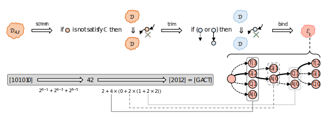
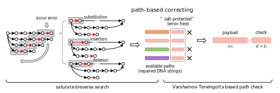
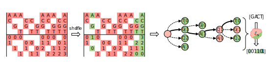

Documentation of SPIDER-WEB
===========================

.. image:: _static/logo.svg

**SPIDER-WEB** is a graph-based architecture in DNA-based storage,
which provides tools for creating stable, repairable, and encryptible algorithms
under arbitrary local biochemical constraints.

First of all, as an algorithm generator, **SPIDER-WEB** provides **graph-based encoding**
under arbitrary local biochemical constraint combinations.

Afterwards, as a decoding repairer, **SPIDER-WEB** supplies **path-based correcting**
for obtained DNA strings with one or more edit errors (including substitution, insertion, and deletion) probabilistically.

Last but not least, as a data confounder, ****SPIDER-WEB**** offers **mapping shuffling**,
to strengthen the capability of privacy protection.

.. toctree::
   :maxdepth: 1
   :hidden:

   installation
   structure
   modules
   customization
   reference
