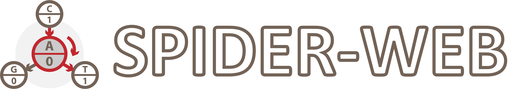

Modules
=======

SPIDER-WEB package consists of four modules:
(1) biochemical constraint module,
(2) transcoding process module,
(3) graph-based operation module, and
(4) fundamental operation module.

.. toctree::
   :maxdepth: 4

Biochemical Constraint Module
------------------------------------------
.. autoclass:: dsw.biofilter.DefaultBioFilter
  :members:
  :undoc-members:
  :show-inheritance:
.. autoclass:: dsw.biofilter.LocalBioFilter
  :members:
  :undoc-members:
  :show-inheritance:

Transcoding Process Module
------------------------------------------
.. autofunction:: dsw.spiderweb.find_vertices
.. autofunction:: dsw.spiderweb.connect_valid_graph
.. autofunction:: dsw.spiderweb.connect_coding_graph
.. autofunction:: dsw.spiderweb.create_random_shuffles
.. autofunction:: dsw.spiderweb.encode
.. autofunction:: dsw.spiderweb.decode
.. autofunction:: dsw.spiderweb.set_vt
.. autofunction:: dsw.spiderweb.repair_dna

Graph-based Operation Module
------------------------------------------
.. autofunction:: dsw.graphized.approximate_capacity
.. autofunction:: dsw.graphized.path_matching
.. autofunction:: dsw.graphized.obtain_formers
.. autofunction:: dsw.graphized.obtain_latters
.. autofunction:: dsw.graphized.obtain_leaf_vertices
.. autofunction:: dsw.graphized.remove_useless
.. autofunction:: dsw.graphized.adjacency_matrix_to_accessor
.. autofunction:: dsw.graphized.accessor_to_adjacency_matrix
.. autofunction:: dsw.graphized.get_complete_accessor
.. autofunction:: dsw.graphized.latter_map_to_accessor
.. autofunction:: dsw.graphized.accessor_to_latter_map

Fundamental Operation Module
------------------------------------------
.. autoclass:: dsw.operation.Monitor
  :members:
  :undoc-members:
  :show-inheritance:
.. autofunction:: dsw.operation.calculus_addition
.. autofunction:: dsw.operation.calculus_subtraction
.. autofunction:: dsw.operation.calculus_multiplication
.. autofunction:: dsw.operation.calculus_division
.. autofunction:: dsw.operation.dna_to_number
.. autofunction:: dsw.operation.number_to_dna
.. autofunction:: dsw.operation.bit_to_number
.. autofunction:: dsw.operation.number_to_bit
