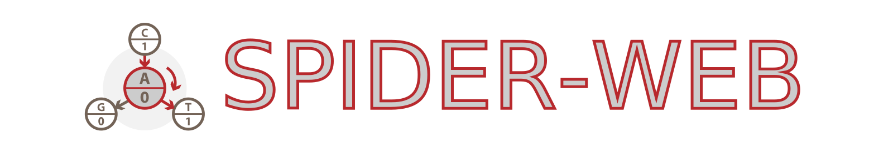

Package Structure
=================

The following figure shows how the package and its algorithms are structured:

.. code-block:: html

    ├── dsw                                     // Source codes of SPIDER-WEB
    │    ├── __init__.py                        // Exhibition of class and method calls
    │    ├── biofilter.py                       // Biochemical constraint filter to judge whether the candidate DNA string is valid or invalid
    │    │    ├── DefaultBioFilter              // Default biochemical constraint filter inherited by all related filters
    │    │    ├── LocalBioFilter                // Local biochemical constraint filter in our work
    │    ├── graphized.py                       // Special data structures and functions related to graph theory
    │    │    ├── get_complete_accessor         // Get a complete accessor with the required observed length
    │    │    ├── adjacency_matrix_to_accessor  // Convert the adjacency matrix to the equivalent accessor (compressed matrix)
    │    │    ├── accessor_to_adjacency_matrix  // Convert the accessor to its equivalent adjacency matrix
    │    │    ├── latter_map_to_accessor        // Convert the latter map (linked storage structure of graph) to its equivalent accessor
    │    │    ├── accessor_to_latter_map        // Convert the accessor to its equivalent latter map
    │    │    ├── remove_useless                // Remove useless vertices (the out-degree of witch less than threshold) in the latter map
    │    │    ├── obtain_formers                // Obtain in-degree vertex indices based on the current vertex index
    │    │    ├── obtain_latters                // Obtain out-degree vertex indices based on the current vertex index
    │    │    ├── obtain_leaf_vertices          // Obtain leaf vertex indices based on the current vertex index and the depth
    │    │    ├── approximate_capacity          // Approximate the capacity of the specific graph through Perron–Frobenius theorem
    │    │    ├── path_matching                 // Perform saturation repair by matching the path of the accessor
    │    ├── operation.py                       // Progress monitor and digital calculation operation
    │    │    ├── Monitor                       // Monitor which outputting the progress based on current state and total state
    │    │    ├── calculus_addition             // Do huge number addition calculus with a small base value, as number + base
    │    │    ├── calculus_subtraction          // Do huge number subtraction calculus with a small base value, as number - base
    │    │    ├── calculus_multiplication       // Do huge number multiplication calculus with a small base value, as number * base
    │    │    ├── calculus_division             // Do huge number division calculus with a small base value, as number / base and number % base
    │    │    ├── bit_to_number                 // Convert a bit array to its equivalent decimal number
    │    │    ├── number_to_bit                 // Convert a decimal number to its equivalent bit array with specific length
    │    │    ├── dna_to_number                 // Convert a DNA string to its equivalent decimal number
    │    │    ├── number_to_dna                 // Convert a decimal number to its equivalent DNA string with specific length
    │    ├── spiderweb.py                       // Generating, transcoding, repairing pipelines of SPIDER-WEB
    │    │    ├── encode                        // Encode a bit array by the specific accessor
    │    │    ├── decode                        // Decode a DNA string by the specific accessor
    │    │    ├── set_vt                        // Set (or calculate) Varshamov-Tenengolts-based path check for DNA string.
    │    │    ├── repair_dna                    // Repair the DNA string containing one (or more) errors
    │    │    ├── find_vertices                 // Find valid vertices based on the given the biochemical constraints
    │    │    ├── connect_valid_graph           // Connect a valid graph by valid vertices
    │    │    ├── connect_coding_graph          // Connect a coding algorithm by valid vertices and the threshold for minimum out-degree
    │    │    ├── create_random_shuffles        // Create the shuffles for accessor through the random mechanism
    ├── experiments                             // Experiment module of SPIDER-WEB
    │    ├── __init__.py                        // Local biochemical constraint set in this work
    │    ├── _1_compatibility.py                // Experiments for the gap between code rates obtained from generated algorithms and the corresponding capacities
    │    ├── _2_reliability.py                  // Experiments for the relative errors of capacity approximation
    │    ├── _3_stability.py                    // Experiments for the code rates obtained from SPIDER-WEB and other advanced algorithms
    │    ├── _4_repairability.py                // Experiments for the probabilistic correction of encoded DNA strings with multiple errors
    │    ├── _5_encrypability.py                // Experiments for the hidden danger of graph (algorithm) reconstruction and additional privacy algorithms
    │    ├── _6_slide_info.py                   // Drawing scheme for result part in the slides
    │    ├── _7_raw_data.py                     // Conversing main raw data to a excel file
    │    ├── __init__                           // Preset parameters in the simulation experiment
    │    ├── code_encode.py                     // Script in the encoding simulation experiment
    │    ├── code_repair.py                     // Script in the correcting simulation experiment
    ├── tests                                   // Test module of source codes
    │    ├── test_accessor_vs_latter_map.py     // Unit test for the conversion between the accessor and the latter map
    │    ├── test_accessor_vs_matrix.py         // Unit test for the conversion between the accessor and the adjacency matrix
    │    ├── test_bio_filters.py                // Unit test for the correctness of the biochemical constraint filter
    │    ├── test_capacities.py                 // Unit test for the reliability if the capacity approximation
    │    ├── test_coding.py                     // Unit test for the default encoding/decoding correctness
    │    ├── test_generating.py                 // Unit test for the generating correctness
    │    ├── test_number_vs_binary_message.py   // Unit test for the conversion between the decimal number and binary message
    │    ├── test_number_vs_dna_string.py       // Unit test for the conversion between the decimal number and DNA string
    │    ├── test_operations.py                 // Unit test for the correctness of large number basic operations
    │    ├── test_shuffles.py                   // Unit test for the transcoding correctness when using the shuffle strategy
    ├── README.md                               // Description document of library

The installation process using 'pip' only includes folder 'dsw' and 'tests'.
