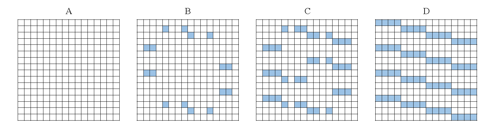
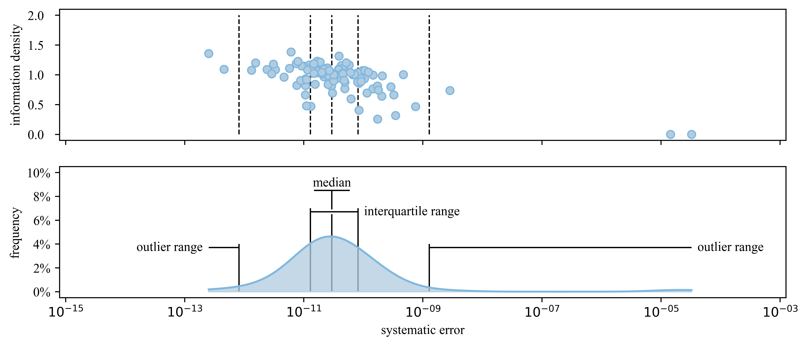
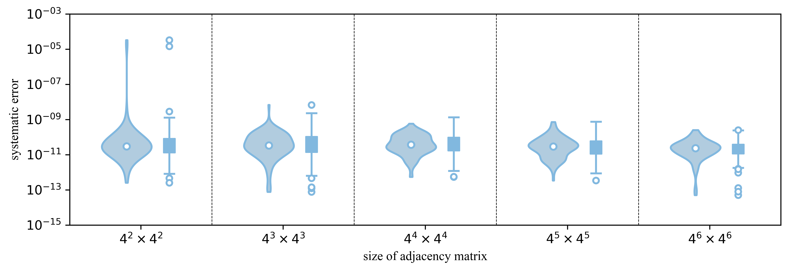
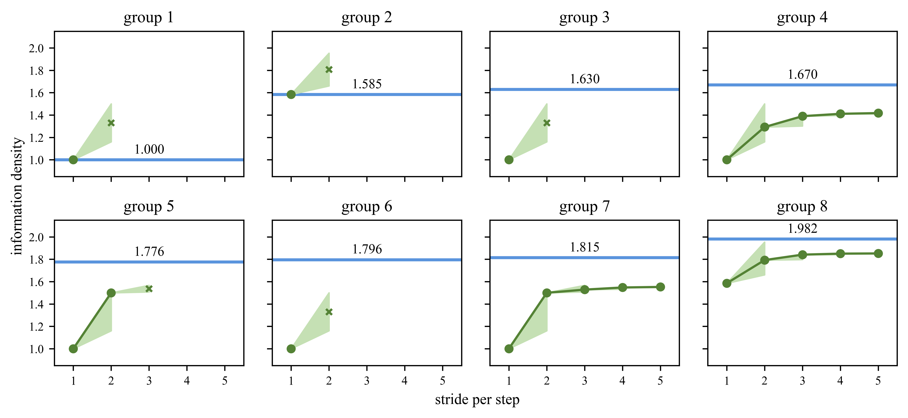
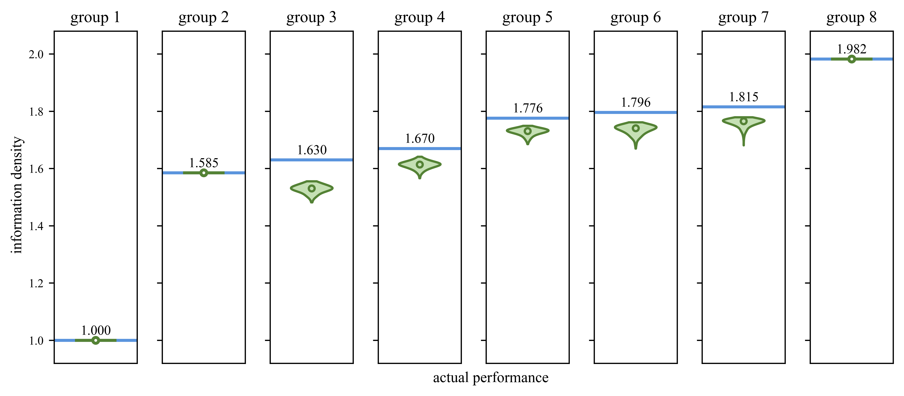

<p align="center">

</p>

---

You can generate the results (25MB) by yourself (step 2 in pipeline folder), it only takes several hours.


Ignored file list:
```html
├── VLC1[t].npy          // Transcoding results of variable-length graph coder with biochemical filter 1
├── VLC2[t].npy          // Transcoding results of variable-length graph coder with biochemical filter 2
├── VLC3[t].npy          // Transcoding results of variable-length graph coder with biochemical filter 3
├── VLC4[t].npy          // Transcoding results of variable-length graph coder with biochemical filter 4
├── VLC5[t].npy          // Transcoding results of variable-length graph coder with biochemical filter 5
├── VLC6[t].npy          // Transcoding results of variable-length graph coder with biochemical filter 6
├── VLC7[t].npy          // Transcoding results of variable-length graph coder with biochemical filter 7
├── VLC8[t].npy          // Transcoding results of variable-length graph coder with biochemical filter 8
├── Practicability.pkl   // Evaluating results of SPECTRA

```

## Practicability of **SPECTRA**

Initially, 4 simple directed graphs with known information density is used for the evaluation, as shown in the figure below:

<p align="center">

</p>

Through **SPECTRA**, the obtained results are consistent with the known results.

We also randomly generate 100 directed graphs, the results are as follow:

<p align="center">

</p>

The error is in the range of 10^-13 to 10^-10 which implies that **SPECTRA** has good practicability.

Besides, such systematic error will not increase with the observed length, the results based on random graphs are as follow:

<p align="center">

</p>


## Actual Performances of **SPIDER-WEB**.


The local biochemical constraint sets are as follow:

| set index | homopolymer run-length | GC-biased range | undesired DNA motifs | information density |
| ---- | ---- | ---- | ---- | ----|
| 1 |  2  | 50%~50% |  AGCT, GACGC, CAGCAG, GATATC, GGTACC, CTGCAG, GAGCTC, GTCGAC, AGTACT, ACTAGT, GCATGC, AGGCCT, TCTAGA | 1.000 |
| 2 |  1  |   N/A   | N/A | 1.585 |
| 3 | N/A | 10%~30% | N/A | 1.630 |
| 4 |  2  | 40%~60% | AGA, GAG, CTC, TCT | 1.670 |
| 5 |  2  | 40%~60% | N/A | 1.776 |
| 6 | N/A | 50%~70% | N/A | 1.796 |
| 7 |  4  | 40%~60% | N/A | 1.815 |
| 8 |  3  |   N/A   | N/A | 1.982 |

The results of fixed-length code are as follows:

<p align="center">

</p>


And those of variable-length code are as follows:

<p align="center">

</p>